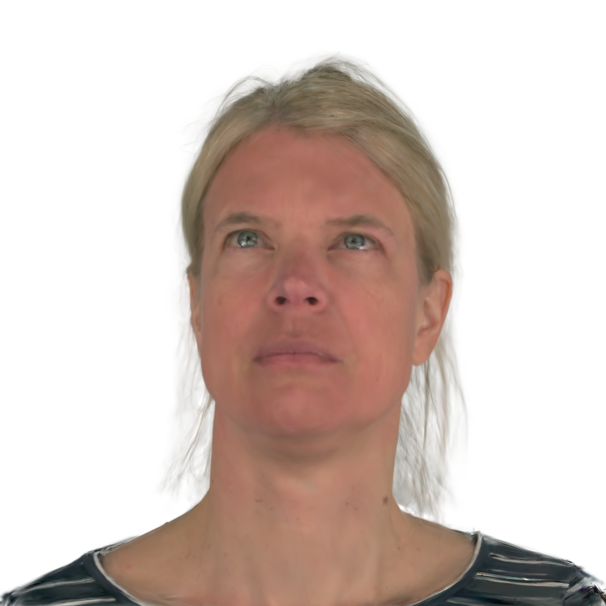
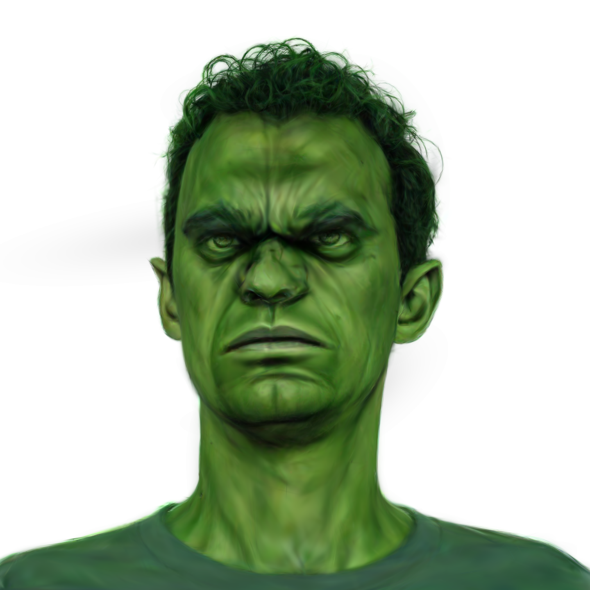
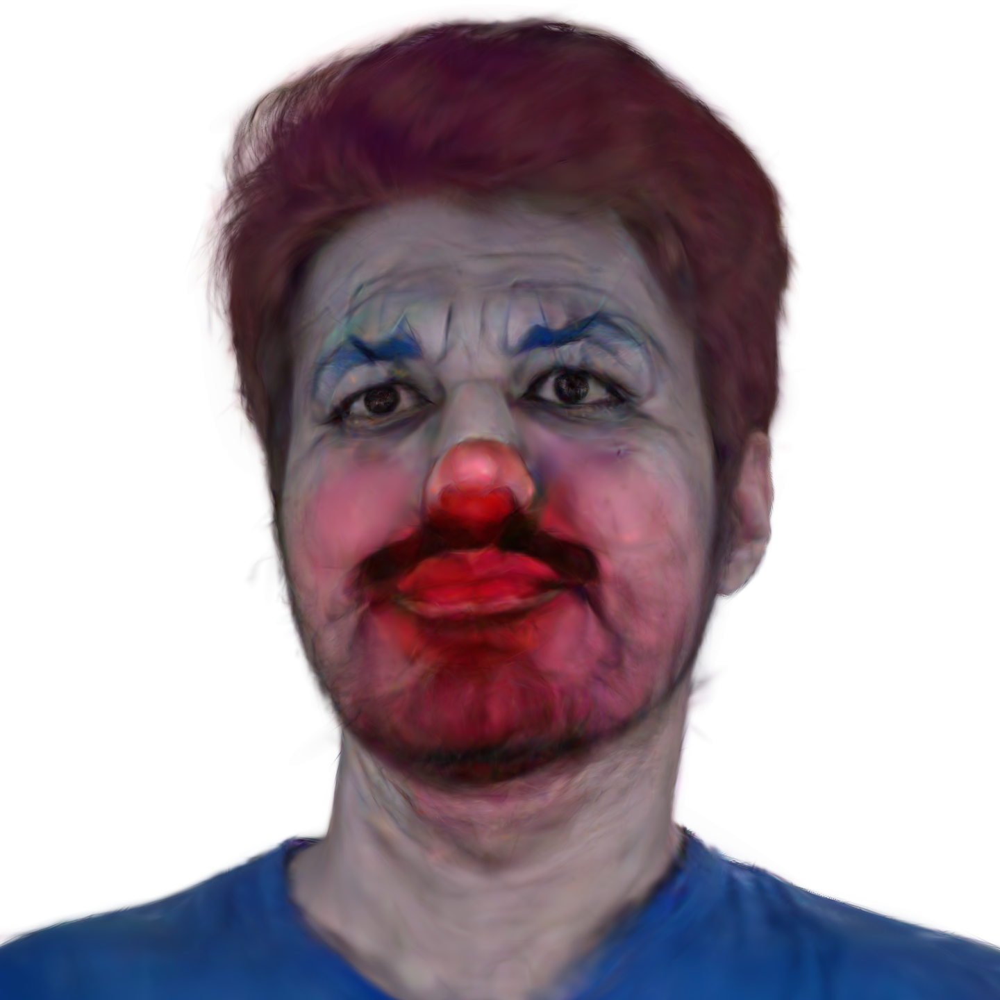

This repository demonstrates our work, DynamicAvatars. Based on GaussianAvatars and GaussianEditor, DynamicAvatars has the ability to edit a dynamic 3D Gaussian Splatting facial avatars by text prompt in 15 minutes.


## Experiment Results

<p align="center">
  <video width="320" height="240" controls><source src="./demo/218/origin.mp4" type="video/mp4"></video>
  <video width="320" height="240" controls><source src="./demo/218/middle-aged%20adult.mp4" type="video/mp4"></video>
</p>
<p align="center">
  
  
  
  
</p>
<p align="center">
  
  
  
  

</p>

## Installation

Clone our repository and create a conda environment to begin.
```
git clone https://github.com/Qyy2737242319/DynamicAvatars.git && cd DynamicAvatars
conda create --name DynamicAvatars python=3.10
conda activate DynamicAvatars
# CUDA version 11.7
pip install torch==2.0.1+cu117 torchvision==0.15.2+cu117 --extra-index-url https://download.pytorch.org/whl/cu117
# CUDA version 11.8
pip install torch==2.0.1+cu118 torchvision==0.15.2+cu118 --extra-index-url https://download.pytorch.org/whl/cu118
pip install -r requirements.txt
```
Install the viser for WebUI use.
```
mkdir extern && cd extern
git clone https://github.com/heheyas/viser 
pip install -e viser
cd ..
```
## Data Preparation

We utilize the pre-processed NeRSamble Dataset used in GaussianAvatars to test our model, you can read the detailed information [here](https://github.com/ShenhanQian/GaussianAvatars/blob/main/doc/download.md).You can also use your custom data by following the instructions provided in it.

Our model takes dynamic point clouds file as the input, which is converted by the dynamic 3D Gaussian Points through the local2global strategy the same as GaussianAvatars. Use GaussianAvatars to train and generate the basic point_cloud.ply file.
```

SUBJECT=306

python train.py \
-s data/UNION10_${SUBJECT}_EMO1234EXP234589_v16_DS2-0.5x_lmkSTAR_teethV3_SMOOTH_offsetS_whiteBg_maskBelowLine \
-m output/UNION10EMOEXP_${SUBJECT}_eval_600k \
--eval --bind_to_mesh --white_background --port 60000
```

You can find the file in the output path.
Put data in the following dataset structure, SUBJECT refers to the id of each facial avatar.
```
DynamicAvatars
|---data
|   |---<SUBJECT>
        |---point_cloud.ply
    ...
```

## Training and Viewing

Using the command to open the WebUI for editing.
```
python train.py --gs_source ./data/{SUBJECT}/point_cloud.ply
-m /home/yang/GaussianAvatars/output/UNION10EMOEXP_{SUBJECT}_eval_600k
```
Open the link provided in the terminal and text the prompt in the box, then click "edit" button. It will automatically download weight files during the first time you use the function. You can adjust training parameters on the webpage in order to get better results.
After training, click the "Save Gaussian" button on the page, and you can view the edited model by script provided in GaussianAvatars.
```
python local_viewer.py --point_path ui_result/point_cloud.ply --id {SUBJECT} 
```

<details>
<summary><span style="font-weight: bold;">Command Line Arguments</span></summary>

- `--point_path`

  Path to the gaussian splatting file (ply).

- `--motion_path`

  Path to the motion file (npz). You only need this if you want to load a different motion sequence than the original one for training.

- `--name`
    Label of the edit type.

- `--ref_json`
    Path to a reference json file. We copy file paths from a reference json into the exported trajectory json file as placeholders so that `render.py` can directly load it like a normal sequence.

- `--track_file`
    Path to a trajectory pkl file. If provided, we use the trajectory written in the file if the number of key frame matches.

Cause the Gaussian Splats are binding to the mesh, you can use FLAME parameters to control the expression of facial avatars.

</details>

## TODO

We are still working on this repository, thanks for your patience. 

- [x] Experiments demo of our method.
- [x] Tutorial for installation and data preparation.
- [x] Usage of training and viewing of results.
- [ ] Additional module enhancing the tooth and eye areas.
## Acknowledgement

Our code is based on following repositories

* [GaussianAvatars](https://github.com/ShenhanQian/GaussianAvatars)

* [GaussianEditor](https://github.com/buaacyw/GaussianEditor)
